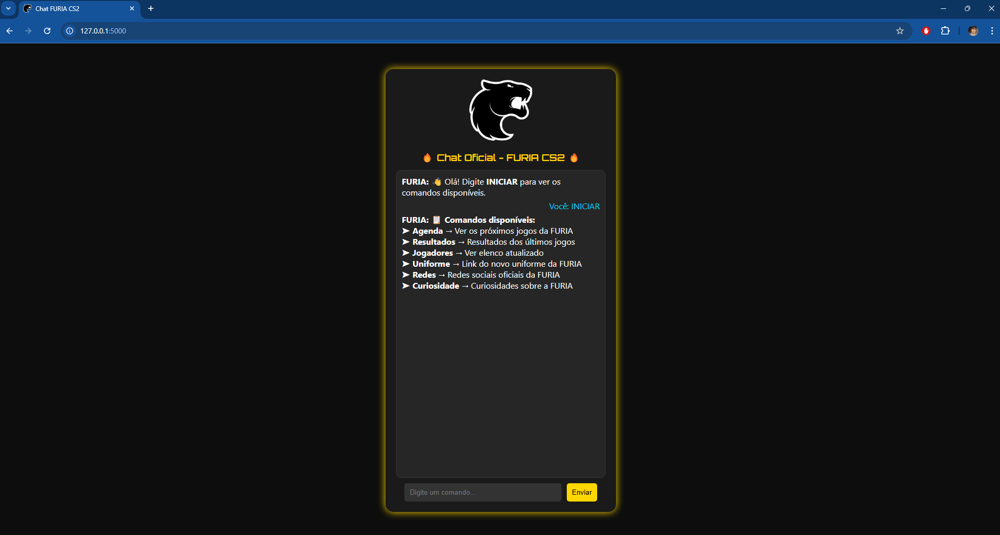
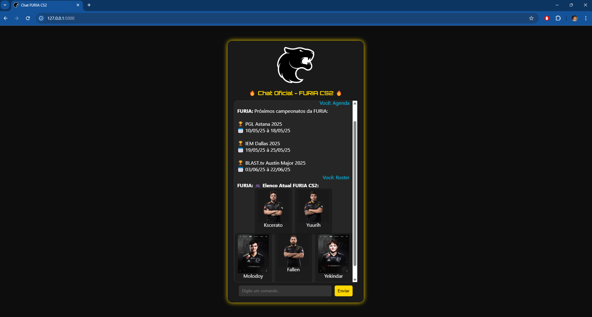

# 🐈‍⬛🔥 Chat Oficial FURIA CS2 - Challenge #1

## 📑 Sumário

- [📋 Sobre o projeto](#-sobre-o-projeto)
- [🚀 Funcionalidades](#-funcionalidades)
- [🎨 Layout](#-layout)
- [🛠 Como rodar localmente](#-como-rodar-localmente)
- [📸 Demonstração](#-demonstração)
- [📚 Estrutura de Pastas](#-estrutura-de-pastas)
- [📢 Contato](#-contato)
- [✨ Observações](#-observações)
- [📌 Licença](#-licença)

---

## 📋 Sobre o projeto

Este projeto é um **chat oficial** para fãs do time de CS2 da FURIA, desenvolvido como parte do **Challenge #1 - Experiência Conversacional**.

O chat simula uma interação oficial, permitindo que os fãs recebam informações como próximos jogos, elenco, últimas partidas, curiosidades, frases e redes sociais do time.

Tecnologias utilizadas:

- Flask (Python)
- HTML5
- CSS3
- Javascript

---

## 🚀 Funcionalidades

- **iniciar** → Ver comandos disponíveis
- **agenda** → Verificar o próximo jogo da FURIA
- **resultados** → Resultados dos últimos jogos
- **jogadores** → Elenco atualizado de CS2
- **uniforme** → Link do novo manto da FURIA
- **redes** → Links das redes sociais oficiais
- **curiosidade** → Curiosidades sobre a FURIA

---

## 🎨 Layout

- Visual inspirado nas cores da FURIA (preto, dourado e branco)
- Design responsivo, compatível com dispositivos móveis
- Experiência rápida e intuitiva para o fã

---

## 🛠 Como rodar localmente

Clone o projeto:

```bash
git clone https://github.com/alexandrebmj/chat-furia-cs2.git
```

Entre na pasta do projeto:

```bash
cd chat-furia-cs2
```

Instale as dependências (se necessário):

```bash
pip install -r requirements.txt
```

Execute o projeto:

```bash
python app.py
```

Acesse no navegador:

```
http://127.0.0.1:5000/
```

---

## 📸 Demonstração

Abaixo, algumas capturas de tela mostrando a interface do chat:


*Página principal com comandos disponíveis.*


*Exemplo de interação com o bot sobre próximos jogos e elenco.*

---

## 📚 Estrutura de Pastas

```
FURIA-CS-CHATBOT/
├── static/                # Arquivos estáticos
│   ├── furia-logo.png
│   ├── print1.png
│   ├── print2.png
│   └── styles.css
├── templates/             # Templates HTML
│   └── index.html
├── .gitignore
├── app.py                 # Arquivo principal do Flask
├── README.md
└── requirements.txt
```

---

## 📢 Contato

Desenvolvido por **AlexandreBMJ** 🚀\
GitHub: [alexandrebmj](https://github.com/alexandrebmj)

---

## ✨ Observações

- Projeto feito para fins educacionais e de demonstração de skills.
- Não é um chatbot oficial da FURIA Esports.

---

## 📌 Licença

Este projeto está sob a licença **MIT**.

---

# 🔥 Let's go, FURIA! 🔥🖤

